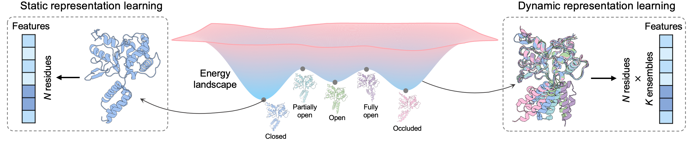

# DyProL

DyProL is a dynamic protein representation learning framework for protein-nucleic acid binding-site prediction.  
Instead of relying on a single static protein structure, DyProL models each protein as a conformational ensemble and learns geometry-aware representations across multiple states.



## Overview

DyProL is designed for residue-level binding-site prediction on:
- DNA-binding proteins
- RNA-binding proteins

The framework supports both:
- `dynamic` mode: uses conformational ensembles
- `static` mode: uses a single structure

In addition to structural inputs, DyProL can incorporate sequence-derived features when working with the `GraphBind` data source.


## Dataset Release

The full `Datasets/` directory will be released on Zenodo and should be placed at the repository root after download.

### Dataset Sources

DyProL currently supports two benchmark settings:

- `DyProL`: the dynamic ensemble dataset used in the main experiments
- `GraphBind`: the public benchmark dataset used for cross-dataset evaluation

### Data Layout

The expected directory structure is:

```text
Datasets/
├── DyProL/
│   ├── DNA/
│   │   ├── DNA-1022_Train.txt
│   │   ├── DNA-256_Test.txt
│   │   ├── PDB/
│   │   └── BioEmu/ or other ensemble folders
│   └── RNA/
│       ├── RNA-932_Train.txt
│       ├── RNA-234_Test.txt
│       ├── PDB/
│       └── BioEmu/ or other ensemble folders
└── GraphBind/
    ├── DNA/
    │   ├── DNA-573_Train.txt
    │   ├── DNA-129_Test.txt
    │   ├── PDB/
    │   ├── BioEmu/
    │   └── ESM_MSA_PSSM/
    └── RNA/
        ├── RNA-495_Train.txt
        ├── RNA-117_Test.txt
        ├── PDB/
        ├── BioEmu/
        └── ESM_MSA_PSSM/
```

### What the data contain

- `PDB/`: protein structure files used as the structural input
- `BioEmu/`: conformational ensembles sampled for dynamic modeling
- `ESM_MSA_PSSM/`: sequence-derived features used by `GraphBind`
- `*_Train.txt` and `*_Test.txt`: dataset split files for training and evaluation

### Notes on the Zenodo package

- The Zenodo archive should contain the complete `Datasets/` folder.
- After downloading, place the folder directly under the project root so that paths such as `./Datasets/DyProL/DNA/PDB` resolve correctly.
- Large ensemble files are expected to remain outside source code history and be distributed through Zenodo instead.

## Installation

This project is implemented in Python with PyTorch. Install the required dependencies in your preferred environment before running training or inference.

If you already have the dependencies configured, no additional project-specific installation step is required.

## Training

The main training entry point is `train.py`.

### Default training setup

By default, the code uses:

- `data_source = dyprol`
- `dynamic_mode = dynamic`
- `ligand = DNA`
- `ensemble = ESMFlow`

For the dynamic DyProL experiments reported in the paper, you will typically want to set:

- `data_source=dyprol`
- `dynamic_mode=dynamic`
- `use_token=True`
- `use_llm=False`
- `use_msa=False`
- `use_pssm=False`

### Example commands

Train on the DyProL DNA dataset:

```bash
python train.py --data_source dyprol --ligand DNA --dynamic_mode dynamic --ensemble BioEmu
```

Train on the DyProL RNA dataset:

```bash
python train.py --data_source dyprol --ligand RNA --dynamic_mode dynamic --ensemble BioEmu
```

Train on GraphBind:

```bash
python train.py --data_source graphbind --ligand DNA --dynamic_mode dynamic --use_llm True --use_msa True --use_pssm True --use_token True
```

## Prediction

The `predict.py` script provides an inference pipeline for residue-level binding-site prediction.

Example usage:

```bash
python predict.py \
  --ligand DNA \
  --data_source graphbind \
  --model_type dynamic \
  --data_type dynamic \
  --ensemble BioEmu
```

## Configuration Guide

The most important runtime options are defined in `Arguments.py`:

- `--ligand`: `DNA` or `RNA`
- `--data_source`: `dyprol` or `graphbind`
- `--dynamic_mode`: `dynamic` or `static`
- `--ensemble`: `BioEmu`, `ESMFlow`, `ALphaFlow`, or `ESMDiff`
- `--use_token`: residue token features
- `--use_llm`: language model embeddings
- `--use_msa`: MSA features
- `--use_pssm`: PSSM features
- `--n_cluster`: number of representative conformations used for dynamic modeling

### Recommended settings

#### DyProL dataset

- Use `dynamic_mode=dynamic`
- Use `use_token=True`
- Keep `use_llm=False`, `use_msa=False`, and `use_pssm=False`
- Set `ensemble=BioEmu` for dynamic ensemble construction

#### GraphBind dataset

- Use `dynamic_mode=dynamic` for the main benchmark setup
- Sequence features may be enabled depending on the experiment: `use_token`, `use_llm`, `use_msa`, `use_pssm`
- `static` mode is available in the code for controlled comparisons, but the primary benchmark setting is dynamic

## Reproducibility

- Random seed is controlled by `--seed`
- Batch size, learning rate, and model width are configurable through `Arguments.py`
- The default training loop writes logs and checkpoints into `Checkpoints/`

## Citation

If you use DyProL in your work, please cite the associated paper.

## Contact

If you have questions about the code, data layout, or reproducing the experiments, please open an issue or contact the authors.
